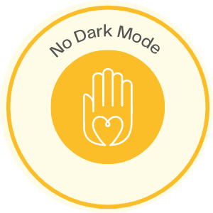

# <div align="center"><h1>No Dark Mode 🌙</h1></div>


<div align="center"><h2>Silly website that won't allow dark mode</h2></div>

<div align="center"></div>

```
Check out the website at : https://nodarkmode.web.app/
```


## Run the app
1. Clone the project
2. run npm i 
3. run npm start


